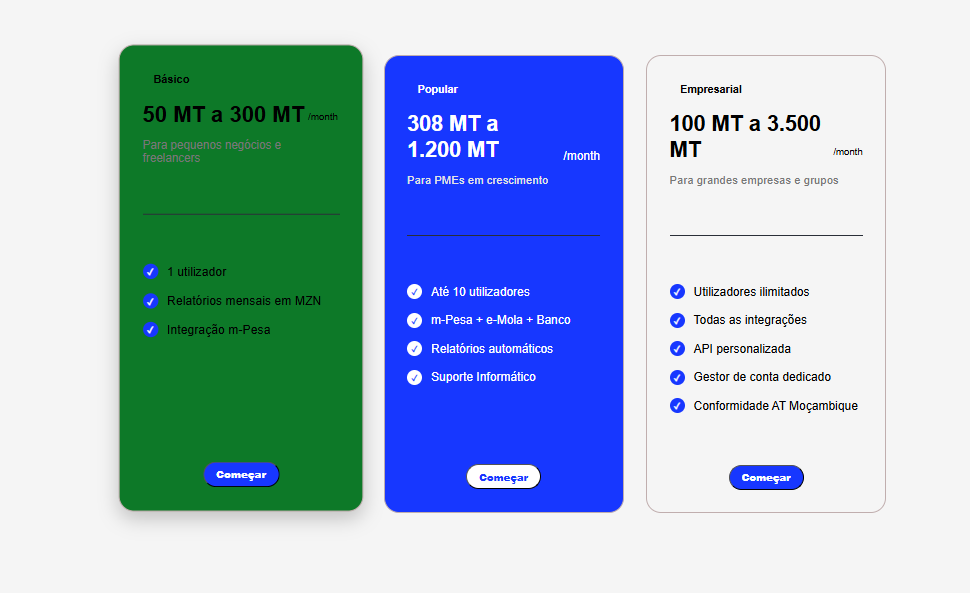
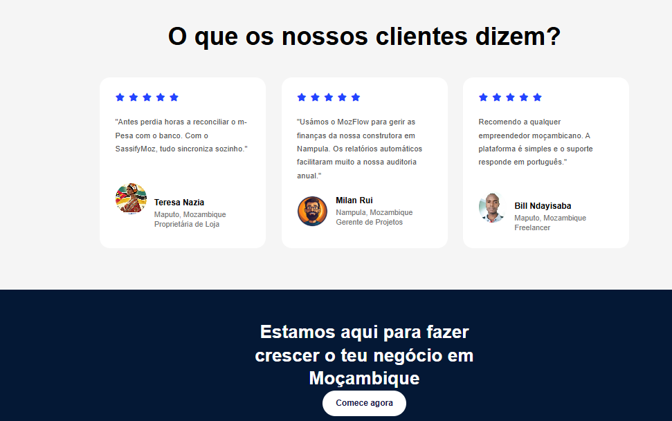

# SassifyMoz 🇲🇿

> Plataforma fictícia de gestão financeira para PMEs moçambicanas — desenvolvida como projecto académico de Web Programming.




---

## 📌 Sobre o Projecto

**SassifyMoz** é uma landing page completa para uma plataforma SaaS fictícia voltada para o mercado moçambicano. O projecto foi desenvolvido no âmbito da disciplina de **Programação Web 1** no ISUTC, com foco na aplicação prática de HTML, CSS e JavaScript puros — sem frameworks.

O produto fictício simula uma ferramenta de gestão financeira integrada com **m-Pesa**, **e-Mola** e bancos locais (BCI, Millennium BIM, Standard Bank), com preços em **Meticais (MZN)** e testemunhos de utilizadores moçambicanos.

---

## 🗂️ Estrutura do Projecto

```
SassifyMoz/
│
├── index.html              # Landing page principal
├── telaSign.html           # Página de registo (Sign Up)
│
├── estilos/
│   ├── saa.css             # Estilos da landing page
│   └── login.css           # Estilos da página de registo
│
├── images/
│   ├── Dashboard (Dark Mode).png
│   ├── brands_moz.png      # Logos das plataformas integradas
│   ├── Image.png
│   ├── Rectangle 130.png
│   └── myPic.jpeg
│
└── script.js               # Lógica JavaScript (DOM + localStorage)
```

---

## 🚀 Funcionalidades

### Landing Page (`index.html`)
- **Header** com navegação responsiva e botão de Sign Up
- **Hero section** com headline e subtítulo em português
- **Área de email** com validação via JavaScript e feedback visual
- **Dashboard** com curva CSS (`border-radius` elíptico) na transição de secção
- **Parceiros integrados** — m-Pesa, e-Mola, Mkesh, BCI, Vodacom
- **Secção de serviços** com 3 cards animados (hover)
- **Secção Get Started** com texto e imagem lado a lado
- **Call to Action azul** com passos numerados
- **Toggle de planos** Mensal/Anual com mudança de preços via JavaScript
- **Cards de preços** — Básico (350 MZN), Popular (1.200 MZN), Empresarial (3.500 MZN)
- **Testemunhos** de utilizadores moçambicanos (Maputo, Nampula)
- **Footer** completo com links, copyright e dark mode support
- **Dark Mode** toggle via botão com classe CSS aplicada ao `body`

### Página de Registo (`telaSign.html`)
- Formulário de criação de conta (nome, email, password)
- Validação de campos via DOM
- Layout de duas colunas (ilustração + formulário)

---

## 🧠 Conceitos Aplicados

| Conceito | Onde foi aplicado |
|---|---|
| **HTML Semântico** | `header`, `main`, `section`, `footer`, `nav` |
| **CSS Flexbox** | Header, cards, layout de duas colunas, brands |
| **Media Queries** | Responsividade para tablet (`max-width: 992px`) e mobile (`max-width: 600px`) |
| **Pseudo-elementos CSS** | `::before` na `.dashboard` para criar a curva elíptica azul |
| **CSS Transitions** | Hover nos cards, botões, imagens (`transform`, `box-shadow`) |
| **DOM Manipulation** | Validação do email, toggle dark mode, troca de preços Mensal/Anual |
| **localStorage** | Persistência do email inserido na secção hero entre sessões |
| **Event Listeners** | `click` no botão de email, `click` no toggle de tema, `click` nos botões de plano |
| **Manipulação de Classes** | `classList.toggle('darkMode')`, `classList.add('active')` |
| **Feedback ao utilizador** | Mensagens de erro/sucesso no `#msg` via JavaScript |

---

## 💡 Destaques Técnicos

### Curva elíptica entre secções
```css
.dashboard::before {
    content: "";
    position: absolute;
    width: 100%;
    height: 71%;
    background: #0d47ff;
    border-bottom-left-radius: 50% 60px;
    border-bottom-right-radius: 50% 60px;
    z-index: 0;
}
```

### Validação de email + localStorage
```javascript
botao.addEventListener('click', function () {
    const email = input.value.trim();
    if (email === '') {
        msg.textContent = 'Por favor, insere o teu email.';
        msg.style.color = 'red';
        return;
    }
    localStorage.setItem('emailUtilizador', email);
    msg.textContent = 'Obrigado! Vamos entrar em contacto em breve.';
    msg.style.color = 'green';
});
```

### Dark Mode via DOM
```javascript
themeBtn.addEventListener('click', function () {
    document.body.classList.toggle('darkMode');
});
```

### Toggle de preços Mensal/Anual
```javascript
mensalBtn.addEventListener('click', function () {
    precoBasico.querySelector('h2').textContent = 'MZN 350';
    precoPopular.querySelector('h2').textContent = 'MZN 1.200';
    precoEmpresa.querySelector('h2').textContent = 'MZN 3.500';
});

anualBtn.addEventListener('click', function () {
    precoBasico.querySelector('h2').textContent = 'MZN 3.360';
    precoPopular.querySelector('h2').textContent = 'MZN 11.520';
    precoEmpresa.querySelector('h2').textContent = 'MZN 33.600';
});
```

---

## Responsividade

O projecto adapta-se a três breakpoints:

- **Desktop** — layout completo, duas colunas, cards em linha
- **Tablet** (`≤ 992px`)
- **Mobile** (`≤ 600px`) — tudo em coluna única, fontes reduzidas, botões a 100%


## 👨🏾‍💻 Autor

**Bill Arsenio Ndayisaba**
Web Developer and Student


*Projecto desenvolvido para fins académicos. 
